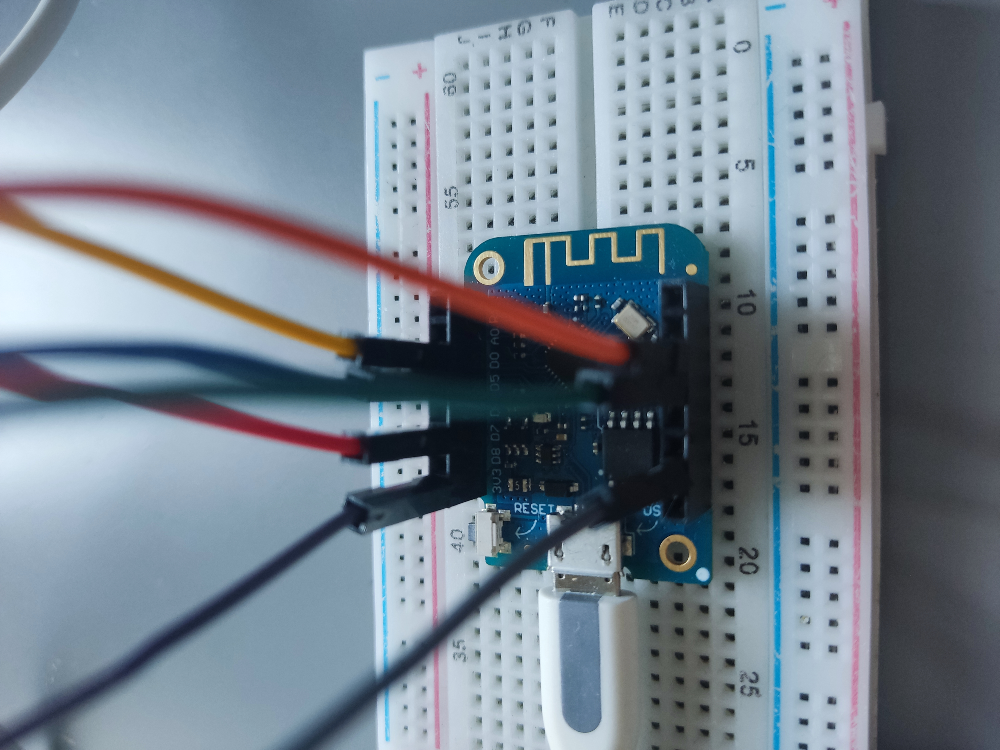

# VästTrafik ESP8266 departure times

## Description
This program fetches departure times from the [Västtrafik](https://www.vasttrafik.se) API and displays it in a nice and easy to read format on a small 1.8 LCD Display.

## Pictures

## Installation
1. Clone the repository
2. Install Python 3.8
3. Install python modules (pip3 install -r requirements.txt)
4. Run `python3 app.py`
5. Open the browser and go to http://localhost:8000/docs/ for documentation
6. Wire up the display and the ESP8266
7. Open Arduino IDE and connect to the ESP8266
8. Install necessary libraries
9. Flash vasstrafik.ino to ESP8266